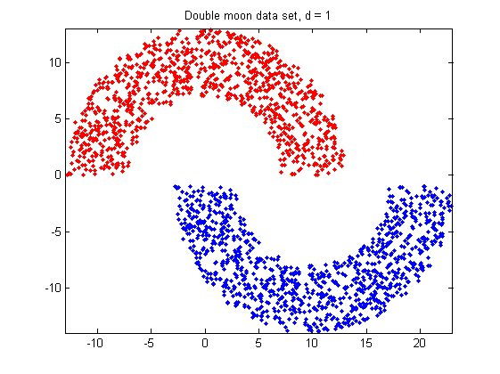

# DoubleMoonClassfy
This is the source code of Double-Moon-Classfy problem

该问提要求利用Rosenblatt 感知机原理对于如图1所示的随机生成的双半月数据进行分类:

图1

具体数据参数如图2所示:

图2

引用图片:

[产生分类中的双月问题的数据集](http://www.cnblogs.com/cpointer/p/4908216.html)

[计算机实验：模式分类](http://book.51cto.com/art/201101/244261.htm)